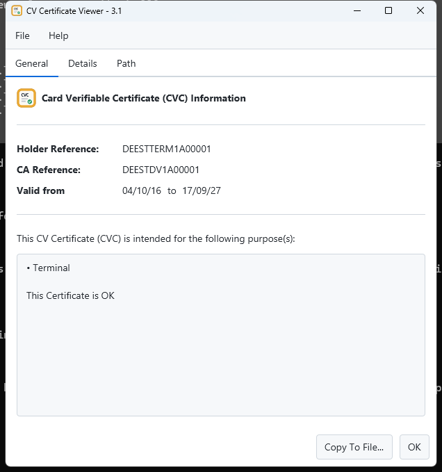
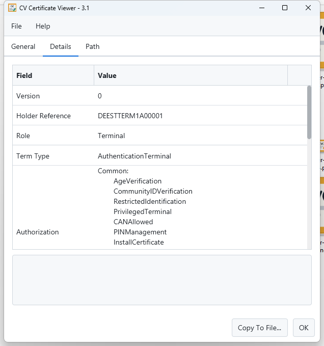
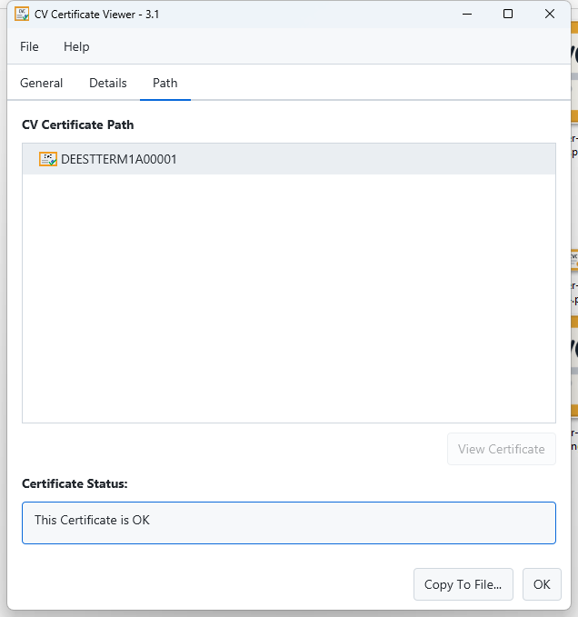

[](https://github.com/realmoieen/CVC-Viewer/actions/workflows/gradle-publish.yml)


# CVC-Viewer


**Website:** [realmoieen.github.io/CVC-Viewer](https://realmoieen.github.io/CVC-Viewer/) &nbsp;·&nbsp; **Author:** Moieen Abbas

---

## Description

**CVC-Viewer** is a desktop utility to view and inspect **Card Verifiable Certificates (CVC)**.
Card Verifiable Certificates are specialized digital certificates designed to be processed by constrained devices such
as **smart cards**.

CVCs are defined in **BSI TR-03110** and are widely used in the **EU EAC (Extended Access Control)** ecosystem for:

* ePassports
* eIDs
* Inspection Systems
* Terminal and DV/IS certificates

This tool provides a **human-readable view** of CV Certificates without assuming X.509 semantics.

---

## Features

* View **CVC (BSI TR-03110)** certificates
* Supports **raw DER**, **Base64**, and **PEM-like** inputs
* Displays:

    * Certificate Holder Reference (CHR)
    * Certificate Authority Reference (CAR)
    * Public Key parameters
    * Validity dates
    * Authorization roles and permissions
    * Authenticated Request / Outer Signature / Outer CAR
    * RSA with PKCSv1.5 and PSS (SHA1, SHA256, SHA512)
    * ECDSA (SHA1, SHA256, SHA512)
* Supports **single certificates** and **certificate chains**
* **Drag and drop** a certificate file onto the window to open it

---

## How to Use CVC-Viewer

CVC-Viewer is a **JavaFX** desktop application (styled with [AtlantaFX](https://github.com/mkpaz/atlantafx)). Each
platform's **GitHub Releases** page offers two kinds of downloads:

* **Installer** (MSI on Windows, DMG on macOS, DEB on Linux) — bundles its own trimmed Java runtime, no
  prerequisites needed on the target machine.
* **Portable** (ZIP on Windows/macOS, tar.gz on Linux) — a much smaller download that ships **no bundled JRE** and
  relies on a **system-installed Java 17 or newer**.

#### Java Requirement (Portable downloads only)

* A **Java 17+ JRE or JDK** must be installed and on `PATH` (or `JAVA_HOME` set)
* The bundled installers have no such requirement — they carry their own runtime

### Windows

**Installer:** run `CVC-Viewer-<version>.msi` from the Windows Releases asset.

**Portable:** extract `CVC-Viewer-<version>-windows-portable.zip` and run `CVC-Viewer-<version>-portable.exe`
(requires system Java 17+).

A **file chooser dialog** appears on launch — select a CV Certificate, CV Request, or related EAC/CVC file — and the
certificate details are displayed in the viewer.

### macOS

**Installer:** open `CVC-Viewer-<version>.dmg` and drag the app into Applications.

**Portable:** extract `CVC-Viewer-<version>-macos-portable.zip` and run the `CVC-Viewer.app` bundle (requires system
Java 17+).

### Linux

**Installer:** install `CVC-Viewer-<version>.deb` via your package manager.

**Portable:** extract `CVC-Viewer-<version>-linux-portable.tar.gz` and run `./cvc-viewer.sh` (requires system Java
17+). A `.desktop` entry is included for menu integration.

⚠️ This application requires a graphical environment to run — headless is not supported.

#### Opening a certificate directly (any platform)

```bash
java -jar CVC-Viewer-<version>.jar <certificate_path>
```

### Windows Integration (Context Menu and File Extension Association Support)

The Windows portable ZIP contains an additional `install.bat` file. Running it registers CVC-Viewer in the Windows
right-click context menu (`Open in CVC Viewer`) and associates it with `.cvreq`/`.cvcert` files.

⚠️ The registration links directly to the extracted EXE — do not move or rename it afterward without re-running
`install.bat`.

---

## Certificate Parsing Logic

CVC-Viewer uses a **robust and format-agnostic certificate parser** designed specifically for CV Certificates.

### Parsing Order

When a certificate file is loaded, the viewer applies the following logic:

1. **PEM with headers**
   If the file contains headers such as:

   ```
   -----BEGIN CERTIFICATE-----
   ```

   the Base64 content is extracted and decoded.

   **Supported PEM Headers Types:**
   ```
    TYPE_CERTIFICATE = "CERTIFICATE";
    TYPE_CV_CERTIFICATE = "CV CERTIFICATE";
    TYPE_CV_LINK_CERTIFICATE = "CV LINK CERTIFICATE";
    TYPE_CV_REQUEST = "CV REQUEST";
    TYPE_CV_AUTHENTICATED_REQUEST = "CV AUTHENTICATED REQUEST";
    ```

2. **Multiple PEM certificates**
   If multiple `BEGIN CERTIFICATE` blocks are found, **all certificates are parsed** and loaded as a list (certificate
   chain support).

3. **Comma-separated Base64 certificates**
   If no headers are present but the file contains multiple Base64 blobs separated by commas, each entry is decoded as a
   separate CV certificate.

4. **Plain Base64 certificate**
   If the content looks like Base64 without headers, it is decoded directly.

5. **Raw binary certificate (DER / CV)**
   If none of the above formats match, the file is treated as **raw binary CV certificate data** and loaded as-is.

This ensures **full compatibility with BSI TR-03110** encoded certificates.

---

## Supported Use Cases

CVC-Viewer supports the following real-world scenarios:

* Viewing **Terminal Certificates (AT / IS / DV)**
* Inspecting **certificate chains** (e.g., CVCA → DV → Terminal)
* Debugging **EAC-based systems**
* Analyzing certificates extracted from:

    * Smart cards
    * HSMs
    * ePassport inspection systems
    * File-based test vectors
* Educational and diagnostic use for **PKI / EAC / ICAO** implementations

---

## Screenshots

### General Tab



### Detail Tab



### Path Tab



---

## How to Build CVC-Viewer

Requires JDK 17+ (Gradle's toolchain support will auto-provision one if needed).

```bash
git clone https://github.com/realmoieen/CVC-Viewer.git
cd CVC-Viewer

# Run from source
./gradlew run

# Run the test suite
./gradlew test

# Self-contained installer (current OS only - msi/dmg/deb are each built on their native OS)
./gradlew jpackageNative

# Portable, no-bundled-JRE artifact for the current OS family
./gradlew portableWindows   # or portableMac / portableLinux
```

Note: `jpackageMac`/`jpackageLinux`/`portableMac`/`portableLinux` must be run on their respective native OS — jpackage
can't cross-compile installers for other platforms, and the JavaFX native libraries bundled into each portable
artifact are platform-specific.

---

## Acknowledgments

This project includes the **Bouncy Castle cryptographic libraries**, available from:

* [http://www.bouncycastle.org/](http://www.bouncycastle.org/)

This project also includes a **CVC module** providing full support for **Card Verifiable Certificates (BSI TR-03110)**
used by EU EAC ePassports and eIDs:

* [https://github.com/eID-Testbeds/common-testbed-utilities](https://github.com/eID-Testbeds/common-testbed-utilities)

The UI is built with **JavaFX** and styled with **[AtlantaFX](https://github.com/mkpaz/atlantafx)**, a modern
open-source JavaFX theme collection.

---

## License

Refer to the repository for licensing details.
